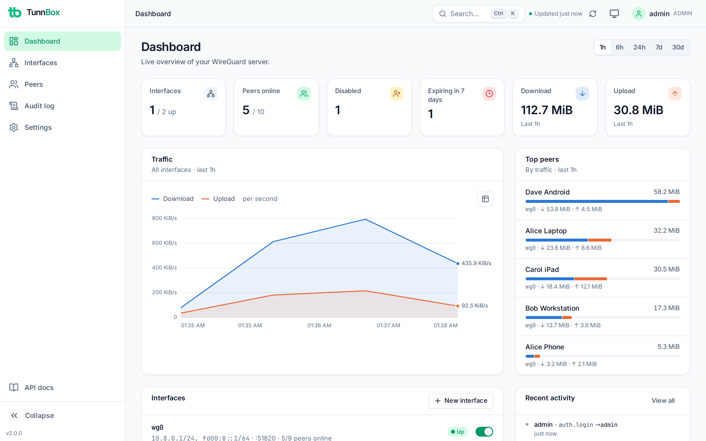

# TunnBox

A self-hosted web application for managing WireGuard VPN servers. One Docker image, a modern
SvelteKit interface, and a FastAPI backend that owns your interfaces, peers, and configs.



## Features

**Manage**
- Multiple WireGuard interfaces with IPv4 and IPv6 subnets, live up/down, config regeneration
- Peers with automatic IP assignment, generated keypairs, preshared keys and notes
- Split tunnelling per peer with presets (full tunnel, LAN only, interface subnet, custom)
- Peer expiry dates with automatic disable, enable/disable without deleting, bulk actions
- One-click onboarding: QR code, `.conf` download, or a one-time share link for the end user

**Observe**
- Live per-peer status, handshake age, endpoint and transfer counters that survive interface restarts
- Historical bandwidth charts per interface and per peer (1h to 30d)
- Dashboard with online peers, expiring peers, top talkers and recent activity
- Searchable, filterable audit log with CSV export

**Secure**
- Sessions with short-lived access tokens, rotating httpOnly refresh cookies, and server-side revocation
- TOTP multi-factor authentication with recovery codes
- Roles (admin, operator, viewer) and scoped API keys for automation
- Login rate limiting and account lockout, strict Content Security Policy, hardened container
- Private keys and MFA secrets encrypted at rest, every change audit-logged

## Quick start

```bash
mkdir tunnbox && cd tunnbox
curl -O https://raw.githubusercontent.com/pgorbunov/tunnbox/main/docker-compose.yml
curl -o .env https://raw.githubusercontent.com/pgorbunov/tunnbox/main/.env.example

# Set WG_DEFAULT_ENDPOINT to your public IP or hostname, and ideally a SECRET_KEY
nano .env

docker compose up -d
```

Open `http://your-server:8000` and follow the setup wizard to create the admin account.

### Requirements

- Linux host with kernel 5.6+ (WireGuard built in) or a host that permits the userspace fallback
- Docker Engine 20.10+ with Docker Compose v2

### Ports

| Port | Protocol | Purpose |
|------|----------|---------|
| 8000 | TCP | Web UI and API |
| 51820 | UDP | WireGuard (one port per interface) |

## Configuration

Runtime settings such as the public endpoint, default DNS, retention and refresh interval are
edited in the UI under **Settings**. Environment variables cover deployment-level options:

| Variable | Description | Default |
|----------|-------------|---------|
| `WG_DEFAULT_ENDPOINT` | Public IP or hostname clients connect to (seeds the setting on first run) | auto-detect |
| `SECRET_KEY` | Root secret for sessions and encryption. `openssl rand -hex 32` | generated and persisted |
| `WG_DEFAULT_DNS` | DNS server(s) for clients | `1.1.1.1` |
| `WG_ALLOW_CUSTOM_SCRIPTS` | Allow PostUp/PostDown commands (run as root) | `false` |
| `TRUSTED_PROXIES` | Reverse proxy IPs/CIDRs trusted for `X-Forwarded-*` headers | none |
| `COOKIE_SECURE` | `auto`, `true` or `false` | `auto` |
| `ACCESS_TOKEN_EXPIRE_MINUTES` | Access token lifetime | `15` |
| `REFRESH_TOKEN_EXPIRE_DAYS` | Idle session lifetime | `7` |

See the [configuration reference](docs/getting-started/configuration.md) for the full list.

## Production deployment

Run TunnBox behind a reverse proxy that terminates HTTPS and bind the UI to localhost only.

```yaml
services:
  tunnbox:
    ports:
      - "127.0.0.1:8000:8000"
      - "51820:51820/udp"
    environment:
      - TRUSTED_PROXIES=172.16.0.0/12

  caddy:
    image: caddy:latest
    restart: unless-stopped
    ports:
      - "80:80"
      - "443:443"
    volumes:
      - ./Caddyfile:/etc/caddy/Caddyfile
      - caddy_data:/data
    depends_on:
      - tunnbox

volumes:
  caddy_data:
```

```text
vpn.example.com {
    reverse_proxy tunnbox:8000
}
```

The [production guide](docs/deployment/production.md) covers Nginx, firewalls and backups.

## Data and backups

Everything lives in `./data/`:

| Path | Contents |
|------|----------|
| `./data/app/tunnbox.db` | SQLite database: users, interfaces, peers (keys encrypted), audit log, stats |
| `./data/app/.secret_key` | Generated root secret when `SECRET_KEY` is not set |
| `./data/wireguard/` | Rendered WireGuard `.conf` files |

Download a full backup from **Settings > Data**, or copy the directory while the container is
stopped. See the [backup guide](docs/guides/backup-restore.md).

### Lost admin password

```bash
docker exec -it tunnbox python -m app.cli reset-password admin
```

## Automation

Create an API key under **Settings > API keys** and call the same API the UI uses:

```bash
curl -H "Authorization: Bearer tb_..." https://vpn.example.com/api/interfaces
```

Interactive documentation is served at `/api/docs`. See the [API reference](docs/api/endpoints.md).

## Development

```bash
# Backend: runs in mock mode automatically when WireGuard is unavailable
cd backend
python -m venv venv && source venv/bin/activate
pip install -r requirements.txt
uvicorn app.main:app --reload

# Frontend
cd frontend
npm install
npm run dev
```

Open `http://localhost:5173`. Run `./test.sh` for backend tests, type checks and a production build.

## Tech stack

| Layer | Technology |
|-------|-----------|
| Backend | FastAPI, Pydantic v2, SQLite (aiosqlite, WAL) |
| Frontend | SvelteKit 2, Svelte 5, Tailwind CSS 4, TypeScript |
| Auth | Server-side sessions, JWT access tokens, bcrypt, TOTP |
| VPN | WireGuard kernel module with wireguard-go fallback |
| Deployment | Docker with dropped capabilities |

## License

MIT. See [LICENSE](LICENSE).
