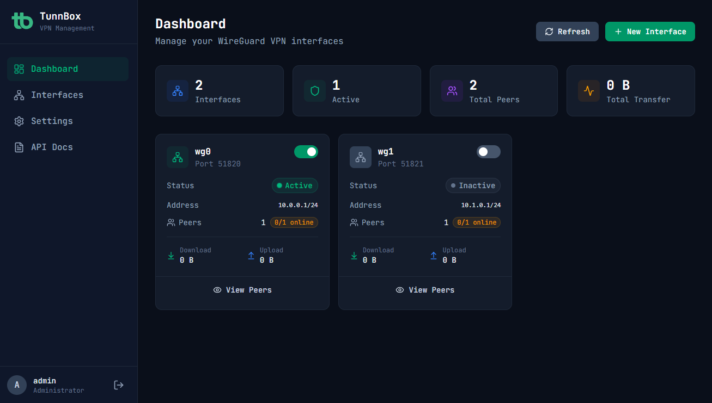

# TunnBox

A modern, polished web application to manage WireGuard VPN servers. Built with FastAPI, SvelteKit, and Tailwind CSS.

## 🚀 Key Features

*   **Interface Management**: Create, configure, and monitor WireGuard interfaces
*   **Peer Management**: Add, edit, and remove peers with automatic key generation
*   **QR Code Generation**: Scan-to-connect QR codes for mobile clients
*   **Real-time Stats**: Monitor bandwidth usage and connection status
*   **Secure Authentication**: JWT-based auth with refresh tokens
*   **Cross-Platform**: Docker-native with a Mock backend for Windows/macOS development

## 📚 Documentation

*   **[Getting Started](./getting-started/installation.md)**: Install TunnBox using Docker or build from source.
*   **[Configuration](./getting-started/configuration.md)**: Learn about environment variables and settings.
*   **[Deployment](./deployment/production.md)**: Deploy with HTTPS and reverse proxies.
*   **[Guides](./guides/interface-management.md)**: Learn how to use the dashboard features.
*   **[Security](./guides/security.md)**: Security features and best practices.
*   **[API Reference](./api/endpoints.md)**: Overview of the REST API.

## License

MIT License - See [LICENSE](../LICENSE) for details.
